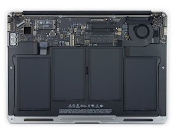

# My Computer
## Computer Specs:

### Brand and model name/number:
* Apple **MacBookAir**
### Operating System:
* __macOS High Sierra__
### CPU:
* **1.6GHz dual-core Intel Core i5** with **3MB** shared **L3 cache**
### RAM:
* **8GB** of **1600MHz** LPDDR3 onboard memory
### Storage (HDD/SSD/Flash/etc.)
* __121.12 GB__ PCIe-based Flash Storage
### Wirless(Wi-Fi/Bluetooth)
| _Wi-Fi:_ | _Bluetooth:_ |
| ----------- | ----------- |
| 802.11ac Wi-Fi wireless networking; IEEE 802.11a/b/g/n compatible | 4.0 wireless technology |
### Ports
* *Two USB 3.0 ports (__up to 5 Gbps__)*
* _Thunderbolt 2 port (__up to 20 Gbps__)_
* *MagSafe 2 power port*
* _SDXC card slot_
* *__3.5 mm__ headphone jack*

SOURCE: [Apple](https://support.apple.com/kb/sp714?locale=en_JO)

## Commentary:
* *I really appreciate and like my computer. This is mostly because I've had it for somewhere around 6 years, it has never let me down and has always been reliable. I try to repay that favor by almost never dropping it.* 😀
* *My computer's performance is affected by its hardware configuration, especially RAM (& Hard Drive), CPU and possibly Wi-Fi.*
1. **RAM (& Hard Drive):** RAM can cause laptops to slow down quite a bit. This is because when a computer uses up all the available RAM, it is forced to start using the hard drive, which is really slower. This is because there then needs to be a constant transfer of data between the RAM and the hard drive memory which really slows a computer down. This usually happens when your computer is running too many applications or programs, which leads me to my example, although it mainly doesn’t apply to my laptop. While on my mom’s laptop which I used to use, which had 4GB RAM, if I had too many programs open such as Google Chrome with tabs for school & entertainment, and if I run any sort of game that takes up lots of memory, along with a Microsoft Word, a bunch of opened random stuff, and more, then the laptop starts going really slow because the 4GB RAM is not able to keep up with and store data from all the programs as I switch between all of them, causing the computer to slow down. This sometimes happens to my laptop with 8Gb RAM, but not as frequently as my mom's.
2. **CPU:**  CPU can also cause laptops to slow down quite a bit. This is because the CPU is in charge of processing whatever you’re doing on your laptop, and is often referred to as the Brain of the Computer because of how important it is to using programs and applications on your computer. So if the CPU is slow, then your computer will not be able to keep up, especially with newer applications or games and it will slow down. This happens to me on my laptop as my CPU is at only 1.6GHz, which is quite low, so when I run games like Fortnite on my computer, it slows down.
3. **Wi-Fi:** **I'm not sure if this would work as a third example,** but another occasion when my laptop slows down is when my Wi-Fi is being a bit slow while I'm writing code like on here or an essay on google docs while doing other online things that use Wi-Fi, such as downloading a game/app, and more. This is because Wi-Fi is responsible for all online things, so when I do too many online things, such as the ones stated in the previous sentence, it causes for example the text to take lots of time to appear on the screen and possibly everything on my computer that uses Wi-Fi starts slowing down/taking lots of time to load because of everything using up the Wi-Fi. So when I have bad Wi-Fi connection, my computer slows down because the Wi-Fi could not support all the online things that I'm trying to do. **I'M NOT SURE IF THIS WOULD REALLY APPLY/WORK SO IF IT'S NOT GOOD PLEASE JUST LOOK AT THE OTHER 2 EXPLANATIONS!😅**
* __My Actual Computer:__

