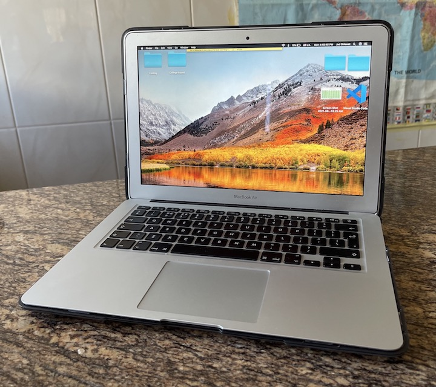

# My Computer

## Computer Specs:
### Brand and model name/number:
* Apple **MacBookAir**
### Operating System:
* __macOS High Sierra__
### CPU:
* **1.6GHz dual-core Intel Core i5** with **3MB** shared **L3 cache**
### RAM:
* **8GB** of **1600MHz** LPDDR3 onboard memory
### Storage (HDD/SSD/Flash/etc.)
* __121.12 GB__ PCIe-based Flash Storage
### Wirless(Wi-Fi/Bluetooth)
| _Wi-Fi:_ | _Bluetooth:_ |
| ----------- | ----------- |
| 802.11ac Wi-Fi wireless networking; IEEE 802.11a/b/g/n compatible | 4.0 wireless technology |
### Ports
* *Two USB 3.0 ports (__up to 5 Gbps__)*
* _Thunderbolt 2 port (__up to 20 Gbps__)_
* *MagSafe 2 power port*
* _SDXC card slot_
* *__3.5 mm__ headphone jack*

SOURCE: [Apple](https://support.apple.com/kb/sp714?locale=en_JO)

## Commentary;
* __*I really aprreciate and like my computer. This is mostly because I've had it for somewhere around 6 years, it has never let me down and has always been reliabe, and I try and repay that favor by almost never dropping it.*__ 😀
* __*My computer's performance is affected by its hardware configuration, especially RAM (& Hard Drive) and CPU.*__
* **RAM (& Hard Drive:** RAM can cause laptops to slow down quite a bit. This is because when a computer uses up all the available RAM, it is forced to start using the hard it, which is really slower. This is because there then needs to be a constant transfer of data between the RAM and the hard drive memory which really slows a computer down. This usually happens when your computer is running too many applications or programs, which leads me to my example, although it doesn’t apply to my laptop. While on my mom’s laptop with 4GB RAM, if I have too many programs open such as Google Chrome with tabs for school & entertainment, and if I run any sort of game that takes up lots of memory, along with the Photo App, Microsoft Word, a bunch of opened random folders, and more, then the laptop starts going really slow because the 4GB RAM is not able to keep up with and store data from all the programs as I switch between all of them, causing the computer to slow down.
* **CPU:**  CPU can cause laptops to slow down quite a bit. This is because the CPU is in charge of processing whatever you’re doing on your laptop, and is often referred to as the Brain of the Computer because of how important it is for using programs and applications on your computer.  So if the CPU is slow, then your computer will not be able to keep up with newer applications or games and will slow down. This happens to me as my CPU is at only 1.6GHz, which is quite low, so when I run games like Fortnite on my computer, it slows down.
